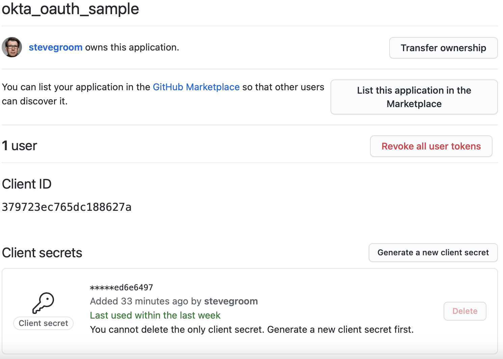
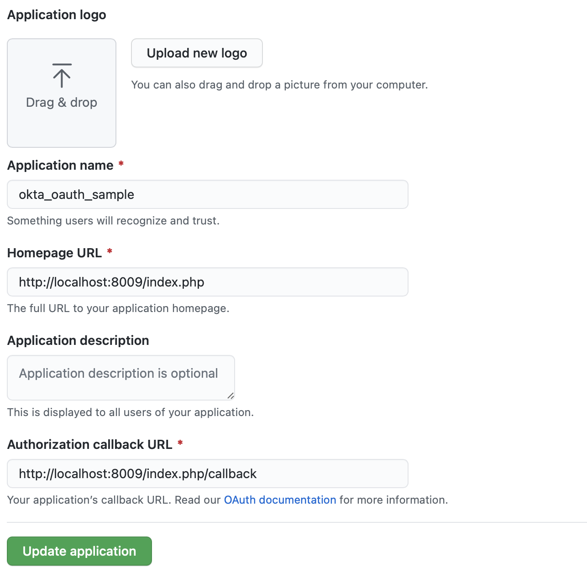
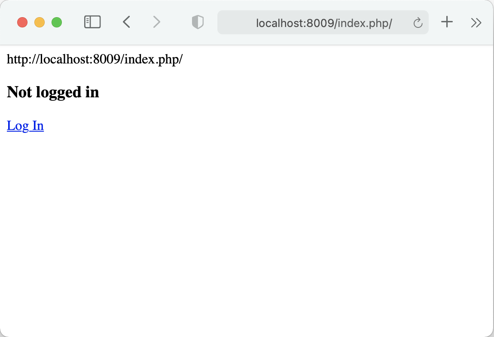
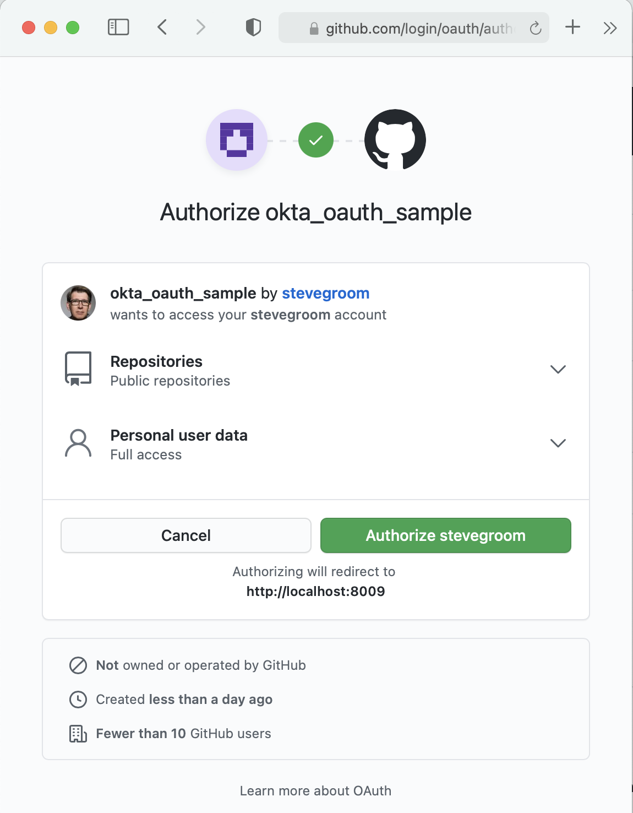
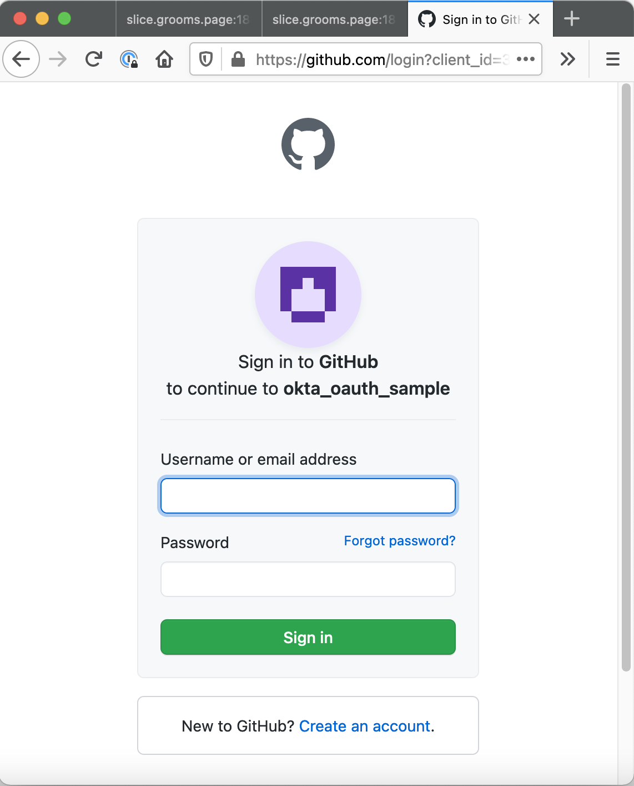
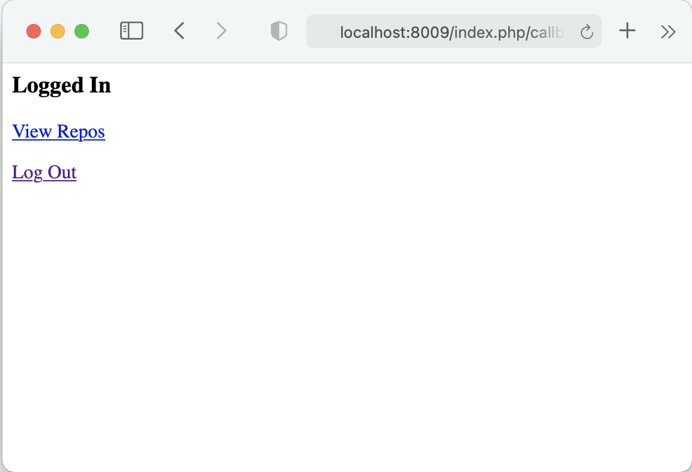

# OKTA OAUTH example with GitHub

From: <https://www.oauth.com/oauth2-servers/accessing-data/>

Created on __slice:/Users/steve/development/OKTA_GITHUB_API_SAMPLE

Registered app on GitHub





__Note:__ the homepage and callback urls needed tweaking.
<http://localhost:8009/index.php> and <http://localhost:8009/index.php/callback> respectively.

To help update line 16

```php
// The URL for this script, used as the redirect URL
$baseURL = 'http://' . $_SERVER['SERVER_NAME'] . ":" . $_SERVER['SERVER_PORT'] . $_SERVER['PHP_SELF'];
```

and add line after 98 ```echo $baseURL```

```php
// If there is an access token in the session
// the user is already logged in
if(!isset($_GET['action'])) {
  if(!empty($_SESSION['access_token'])) {
    echo '<h3>Logged In</h3>';
    echo '<p><a href="?action=repos">View Repos</a></p>';
    echo '<p><a href="?action=logout">Log Out</a></p>';
  } else {
    echo $baseURL;
    echo '<h3>Not logged in</h3>';
    echo '<p><a href="?action=login">Log In</a></p>';
  }
  die();
```

Start the local app with ```php -S localhost:8009```

## Results

### Not Logged In



### Log In



You are being redirected.





### View Repos


### Setup xdebug

```bash
find / -name "xde*so"
/usr/local/lib/php/extensions/no-debug-non-zts-20190902/xdebug.so

zend_extension=/usr/local/lib/php/extensions/no-debug-non-zts-20190902/xdebug.so
cd /usr/local/etc/php
echo "zend_extension=/usr/local/lib/php/extensions/no-debug-non-zts-20190902/xdebug.so" >>php.ini 
echo "xdebug.mode = debug" >>php.ini
echo "xdebug.start_with_request = yes" >>php.ini
echo "xdebug.remote_port = 9003" >>php.ini
echo "xdebug.remote_enable = 1" >>php.ini
echo "xdebug.remote_autostart = 1" >>php.ini
echo "xdebug.remote_connect_back = 0" >>php.ini
#echo "xdebug.remote_host = 192.168.0.30" >>php.ini

root@slice2:/usr/local/etc/php# %
```

## Create favicon.ico from emoji

<https://favicon.io/emoji-favicons/construction/>
